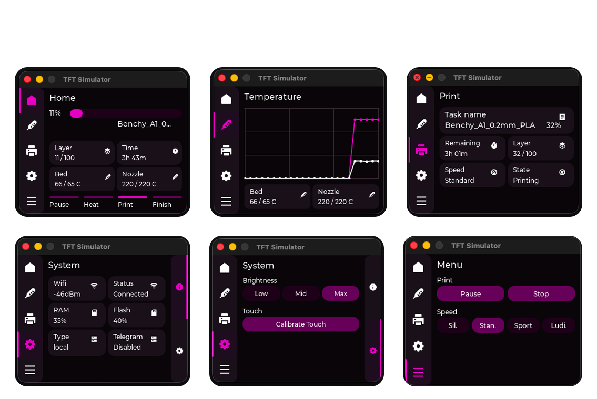

# BlPad - just one another screen for BambuLab A1



This project now uses a shared `LVGL` UI layer so the same screen can run:

- on `BPI-Leaf-S3` with the real `ILI9341` display
- on your PC in an `SDL2` desktop simulator

That lets you iterate on the screen layout without reflashing the board every time.

It currently displays:

- current printer state
- active job name
- progress in percent
- remaining time
- current and target nozzle temperature
- current and target bed temperature
- current and total layers
- Wi-Fi signal reported by the printer

The ESP32 firmware can also optionally run a very small Telegram bot bridge for:

- `/status`
- `/pause`
- `/resume`
- `/stop`
- `/speed silent|standard|sport|ludicrous`
- notifications for `paused`, `resumed`, `finished`, and `offline/online`

## How it works

The firmware connects to your Wi-Fi, opens a TLS MQTT connection to the printer on port `8883`, subscribes to:

`device/<printer_serial>/report`

and requests a full status snapshot on:

`device/<printer_serial>/request`

with the `pushall` command.

The implementation uses:

- shared `LVGL` UI
- Arduino framework on ESP32-S3
- [LovyanGFX](https://github.com/lovyan03/LovyanGFX) as the hardware flush backend for ILI9341
- [PubSubClient](https://github.com/knolleary/pubsubclient) for MQTT
- [ArduinoJson](https://arduinojson.org/) for parsing printer reports
- `SDL2` + `lv_drivers` for desktop preview

## Printer prerequisites

Before flashing the board:

1. On the Bambu printer, enable local network access.
2. On newer firmware, set the printer to `LAN Only` if local MQTT requests are refused.
3. Get the `LAN Access Code`.
4. Note the printer serial number and local IP address.

For A1-series devices, local status/control behavior has changed across firmware versions; local `pushall` requests are known to require LAN mode on recent firmware. Source examples:

- [Bambu Studio issue about local `pushall`](https://github.com/bambulab/BambuStudio/issues/4154)
- [Community report for A1 local MQTT](https://forum.bambulab.com/t/mqtt-for-a1/50033?page=4)

## Wiring

`include/app_config.h` contains the default SPI wiring:

- `SCLK -> GPIO12`
- `MOSI -> GPIO11`
- `CS -> GPIO10`
- `DC -> GPIO9`
- `RST -> GPIO8`
- `BL -> GPIO7`

Change these pins to match your actual wiring on the BPI-Leaf-S3.

## Configure

Edit [include/app_config.h](/Users/princeess/Work/bambulab-screen/include/app_config.h) and set:

- your Wi-Fi SSID/password
- printer IP
- printer serial
- Bambu LAN access code
- display pins if they differ
- optionally `TELEGRAM_BOT_TOKEN` and `TELEGRAM_CHAT_ID` to enable the built-in bot

If `TELEGRAM_BOT_TOKEN` or `TELEGRAM_CHAT_ID` is empty, Telegram support stays disabled.

## Desktop preview

Default PlatformIO environment is `desktop_preview`.

```bash
PLATFORMIO_CORE_DIR=.pio-core pio run -e desktop_preview
```

Then run the produced desktop binary:

```bash
.pio/build/desktop_preview/program
```

The simulator uses mock printer data and updates the screen once per second.

## Desktop preview with real printer data

You can run the desktop UI against the real printer without flashing the board.

1. Install the Node.js dependency:

```bash
cd /Users/princeess/Work/bambulab-screen
npm install
```

2. Start the MQTT bridge:

```bash
cd /Users/princeess/Work/bambulab-screen
npm run live-bridge
```

It reads printer credentials from [include/app_config.h](/Users/princeess/Work/bambulab-screen/include/app_config.h), connects to the printer MQTT broker, and writes live state into:

`artifacts/live_state.txt`

3. Run the desktop preview against that file:

```bash
cd /Users/princeess/Work/bambulab-screen
BAMBU_LIVE_STATE_FILE=artifacts/live_state.txt .pio/build/desktop_preview/program
```

If `BAMBU_LIVE_STATE_FILE` is not set, the simulator falls back to mock data.

## Firmware build

```bash
PLATFORMIO_CORE_DIR=.pio-core pio run -e bpi_leaf_s3
```

## Flash

```bash
PLATFORMIO_CORE_DIR=.pio-core pio run -e bpi_leaf_s3 -t upload
```

## Notes

- The code uses `setInsecure()` for the TLS client to keep the local printer connection simple.
- The report payload is partially incremental on some firmware, so the code updates only fields present in each MQTT message.
- `pushall` is sent every 30 seconds. If you want lower traffic, increase `PUSHALL_INTERVAL_MS`.
- On macOS, `desktop_preview` expects `SDL2` headers and libs in Homebrew paths:
  `-I/opt/homebrew/include`, `-I/opt/homebrew/include/SDL2`, `-L/opt/homebrew/lib`, `-lSDL2`.
